# 💼 Applyist — Job Tracker AI

A full-stack web application that helps IT candidates manage their entire job hunt — tracking applications through every stage, managing CV versions, and using AI to analyze how well a CV matches a job description.

🌐 **Live Demo:** [https://applyist.vercel.app](https://applyist.vercel.app)

🎬 **Video Demo:** [https://youtu.be/SKMgRnkJIY0](https://youtu.be/SKMgRnkJIY0)

> ⏳ Backend is hosted on Render's free tier — the first request after idle may take **~60 seconds** to cold-start.

---

## 📸 Screenshots

### Authentication
| Login |
|---|
| 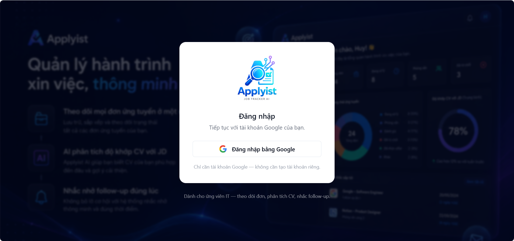 |

### Applications
| Application List | Application Detail |
|---|---|
| 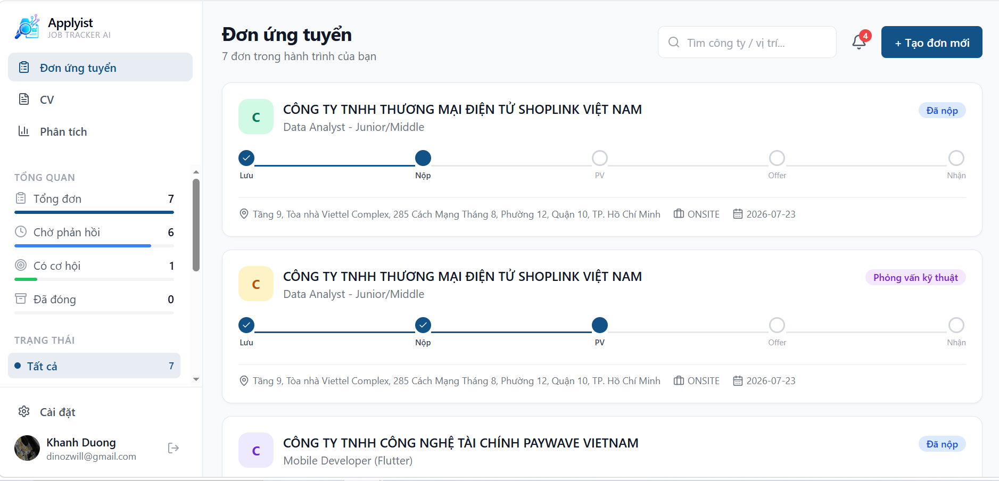 | 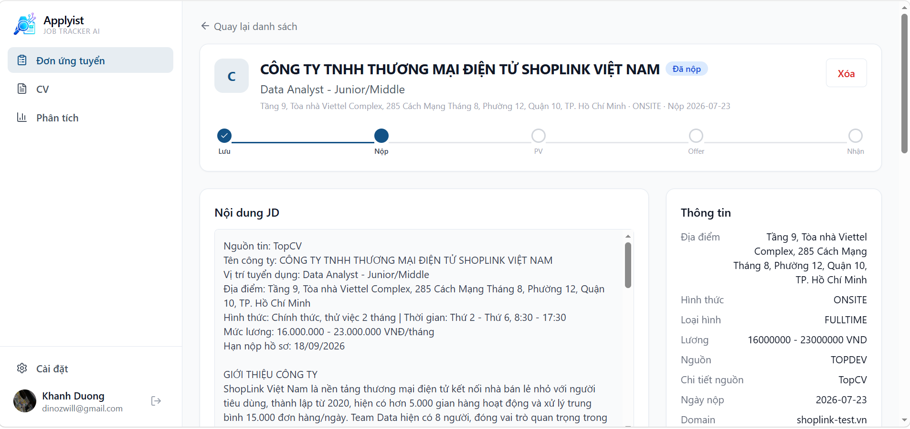 |

| Create Application (AI auto-fill from JD) |
|---|
| 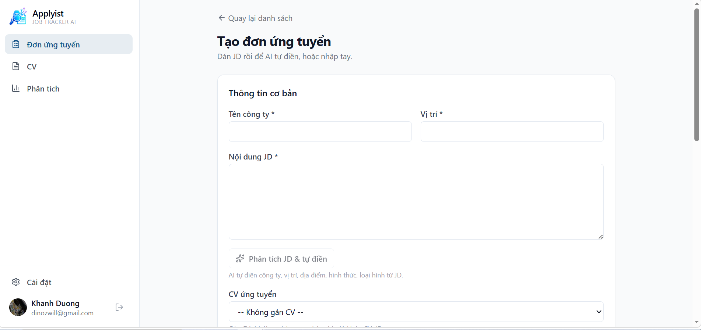 |

### AI Analysis
| JD Insight | CV–JD Match | AI Email Draft |
|---|---|---|
| 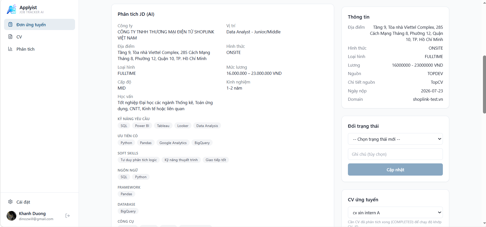 | 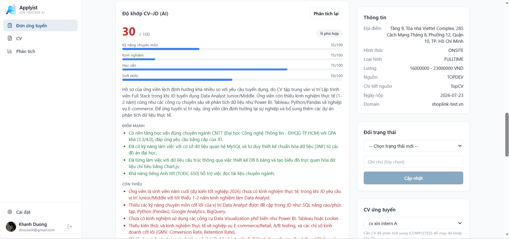 | 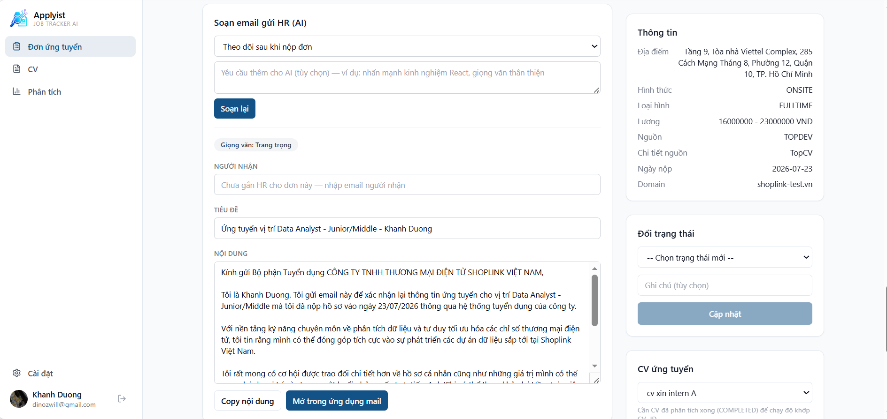 |

### CV Management
| CV List (PDF thumbnails) | CV Detail (PDF + parsed data editor) |
|---|---|
| 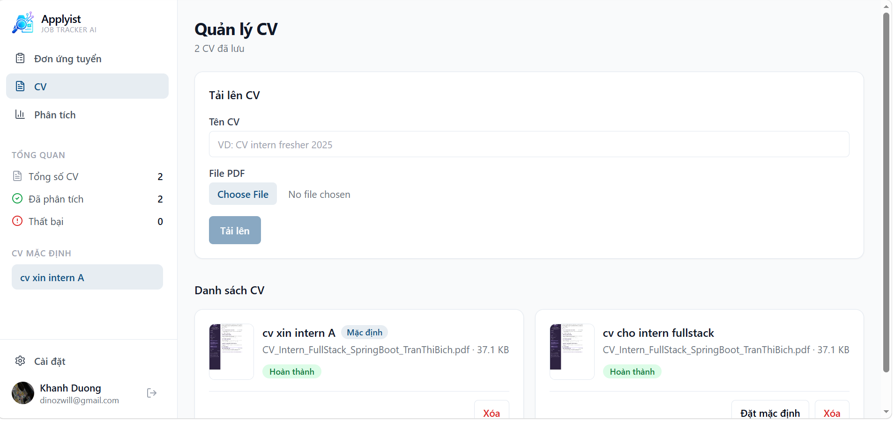 | 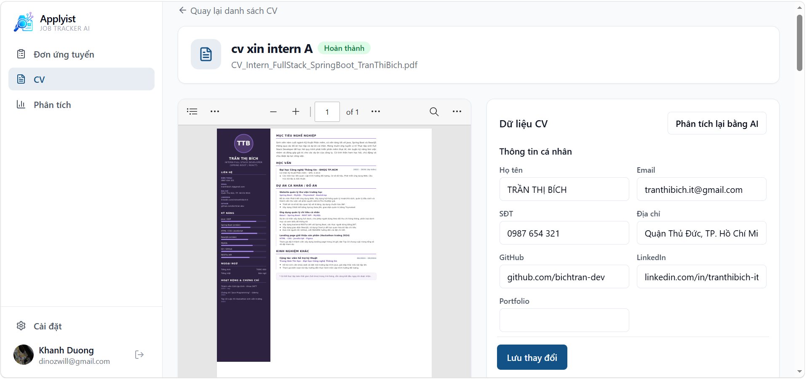 |

### Analytics
| Analytics Dashboard |
|---|
| 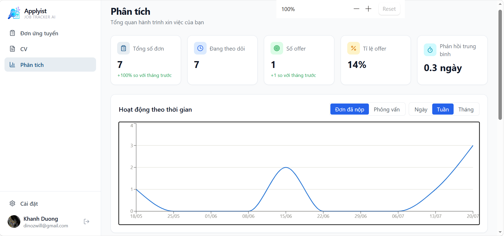 |

### Reminders & Settings
| Notifications & Reminders | Settings |
|---|---|
| 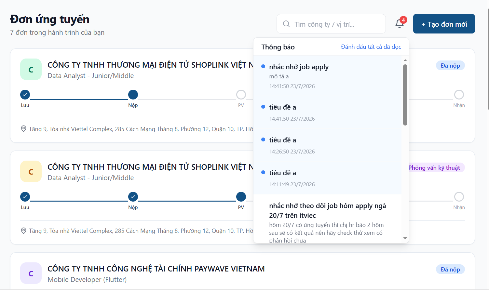 | 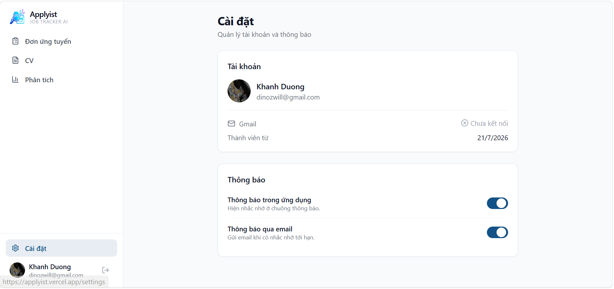 |

---

## ✨ Features

### Authentication
- **Google OAuth 2.0** single sign-on (no password stored)
- **JWT** authentication — short-lived access token (15 min) + refresh token rotation (7 days)
- Per-session refresh tokens with device metadata, logout revokes the session

### Application Tracking
- Full CRUD for job applications: company, position, salary range, work type, source, contact person, JD content, notes
- **Status state machine** — SAVED → APPLIED → PHONE_SCREEN → TECHNICAL_INTERVIEW → ONSITE → OFFER → ACCEPTED, with REJECTED / WITHDRAWN exits; invalid transitions are blocked server-side
- Complete **status history** and a custom **timeline of events** (interviews, phone calls, emails…) per application
- Search with debounce, multi-status filter, pagination
- Status overview sidebar with live counts and progress stepper on each card

### CV Management
- Upload PDF CVs, stored on **Cloudinary**, with PDF **thumbnail previews**
- **AI auto-parse** on upload — extracts skills, experience, education, projects into structured data (async, with polling status)
- Review and **edit parsed data** side-by-side with the PDF, re-parse on demand
- Attach a specific CV version to each application

### AI Integration (Google Gemini)
- **Extract JD** — paste a job description and auto-fill the create-application form
- **JD Insight** — extracts required skills, experience level, and highlights from the JD
- **CV–JD Match** — scores how well the attached CV matches the JD, with strengths, gaps, and improvement suggestions
- **AI email drafts** — 3 templates (follow-up after applying, thank-you after interview, status inquiry), editable before sending via `mailto:` or copy-paste
- Results cached in DB by input hash — no duplicate Gemini calls for unchanged content
- Retry with exponential backoff, distinguishes transient (429/5xx) vs permanent (4xx) errors

### Reminders & Notifications
- **Auto-generated reminders**: follow-up after applying, stale status alerts (daily scheduled job with dedup)
- Custom reminders per application
- **In-app notifications** — bell with unread badge (polling) + toast popups for newly arrived notifications
- **Email channel** via SMTP, respecting per-user notification preferences (in-app / email toggles)

### Analytics
- Overview cards: total applications, active, offers, offer rate, average response time
- **Application funnel** — how far applications progress, counted from status history
- **Time series** — applications/interviews by day, week, or month
- **Source analysis** — which job boards convert to offers
- **Activity heatmap** — GitHub-style, one year of status-change activity

---

## 🛠️ Tech Stack

### Backend
| Technology | Usage |
|---|---|
| Java 17 + Spring Boot 3.2 | Core framework (modular monolith) |
| Spring Security + JWT | Authentication & authorization |
| Spring Data JPA + Hibernate | ORM & database access |
| PostgreSQL 15 | Relational database (JSONB for parsed CV / AI results) |
| Flyway | Database migrations |
| Google Gemini API | AI analysis (JD extract, CV parse, matching, email drafts) |
| Cloudinary | PDF file storage + thumbnails |
| Apache PDFBox | PDF text extraction |
| Spring Mail (SMTP) | Reminder emails |
| Spring Scheduling + Async | Reminder jobs, background AI parsing |

### Frontend
| Technology | Usage |
|---|---|
| React 19 + TypeScript | UI framework |
| Vite | Build tool |
| Tailwind CSS + shadcn/ui tokens | Styling (navy design system) |
| TanStack Query v5 | Server state, caching, polling |
| React Hook Form + Zod | Forms & validation |
| React Router v7 | Client-side routing |
| Recharts + date-fns | Analytics charts |
| Axios | HTTP client with token refresh interceptor |

---

## 🏗️ System Architecture

```
┌──────────────────┐          ┌───────────────────────┐
│   React + TS     │ ──JWT──▶ │   Spring Boot API     │
│    (Vercel)      │ ◀──────  │   (Render, Docker)    │
└──────────────────┘          └───────────┬───────────┘
                                          │
                       ┌──────────────┬───┴──────────┬──────────────┐
                       │              │              │              │
                ┌──────▼──────┐ ┌─────▼─────┐ ┌──────▼─────┐ ┌──────▼─────┐
                │    Neon     │ │  Gemini   │ │ Cloudinary │ │    SMTP    │
                │ (Postgres)  │ │    API    │ │ (PDF/img)  │ │  (email)   │
                └─────────────┘ └───────────┘ └────────────┘ └────────────┘
```

Backend is a **modular monolith** — one deployable, modules communicate by direct service calls:

`auth` · `user` · `cv` · `application` · `ai` · `email` · `notification` · `reminder` · `analytics` · `shared`

---

## 🚀 Getting Started

### Prerequisites
- Java 17+
- Node.js 20+
- Docker + Docker Compose (for PostgreSQL)
- Google Cloud OAuth Client ID ([console.cloud.google.com](https://console.cloud.google.com/apis/credentials))
- Gemini API key ([aistudio.google.com](https://aistudio.google.com/app/apikey))
- Cloudinary account (free tier) — enable **Settings → Security → "Allow delivery of PDF and ZIP files"**

### 1. Clone the repository
```bash
git clone https://github.com/khanhduong290409/Job-tracker-AI.git
cd Job-tracker-AI
```

### 2. Setup Backend

```bash
cp .env.example .env
```

Fill in the important variables in `.env`:

```env
DB_HOST=localhost
DB_PORT=5432
DB_NAME=jobtracker
DB_USER=postgres
DB_PASSWORD=postgres

JWT_SECRET=your_32_byte_base64_secret

GOOGLE_CLIENT_ID=your_google_client_id
GOOGLE_CLIENT_SECRET=your_google_client_secret
GOOGLE_REDIRECT_URI=http://localhost:5173/auth/callback

GEMINI_API_KEY=your_gemini_api_key
GEMINI_MODEL=gemini-3.6-flash

CLOUDINARY_CLOUD_NAME=your_cloud_name
CLOUDINARY_API_KEY=your_api_key
CLOUDINARY_API_SECRET=your_api_secret

# Optional — reminder emails (use a free Mailtrap inbox for dev)
MAIL_USERNAME=
MAIL_PASSWORD=
```

Start PostgreSQL and run the backend:

```bash
docker compose up -d          # PostgreSQL (+ Redis, currently unused)

cd backend
./mvnw spring-boot:run
```

The API runs at `http://localhost:8080` — Swagger UI at `http://localhost:8080/swagger-ui.html`

### 3. Setup Frontend

```bash
cd frontend
cp .env.example .env          # defaults work for local dev
npm install
npm run dev
```

The app runs at `http://localhost:5173`

---

## 📂 Project Structure

```
Job-tracker-AI/
├── backend/                          # Spring Boot (modular monolith)
│   └── src/main/java/com/jobtrackerai/
│       ├── auth/                     # Google OAuth + JWT + refresh sessions
│       ├── user/                     # Profile + notification preferences
│       ├── cv/                       # CV upload, AI parse, parsed-data editing
│       ├── application/              # CRUD + state machine + history + timeline
│       ├── ai/                       # JD insight, CV–JD match (DB-cached)
│       ├── email/                    # AI email drafts
│       ├── notification/             # In-app notifications
│       ├── reminder/                 # Scheduled generators + dispatcher
│       ├── analytics/                # Aggregate queries for dashboard
│       └── shared/                   # Gemini client, mail, storage, security, config
│   └── src/main/resources/db/migration/   # Flyway V1..V8
│
├── frontend/                         # React + TypeScript
│   └── src/
│       ├── features/                 # auth, applications, cv, ai, email,
│       │                             # notifications, reminders, settings, analytics
│       ├── components/               # Shared UI (toast, confirm dialog, layout, sidebar)
│       ├── lib/                      # Axios client, utils
│       └── routes.tsx
│
├── docs/                             # Full specs (features, DB schema, API contract, …)
└── docker-compose.yml                # PostgreSQL + Redis for local dev
```

---

## ☁️ Deployment

| Component | Platform | Notes |
|---|---|---|
| Frontend | **Vercel** | Static build, SPA rewrites via `vercel.json` |
| Backend | **Render** (free) | Multi-stage Dockerfile, `SPRING_PROFILES_ACTIVE=prod` |
| Database | **Neon** (Postgres) | Serverless, Singapore region, `sslmode=require` |
| Uptime | **UptimeRobot** | Pings `/actuator/info` every 10 min to prevent spin-down |

Full runbook with exact environment variables and setup order: [docs/deployment.md](docs/deployment.md)

---

## ⚠️ Known Issues

- Render free tier blocks outbound SMTP → reminder **emails don't send in production** (in-app notifications still work; email works locally with Mailtrap)
- Swagger UI (`/v3/api-docs`) returns 500 in production (works locally)
- Unknown API paths return 500 instead of 404
- Gemini free tier is rate-limited (5 requests/min) — AI features may return "service busy" under rapid use

---

## 📝 License

This project is built for educational purposes and portfolio demonstration.
